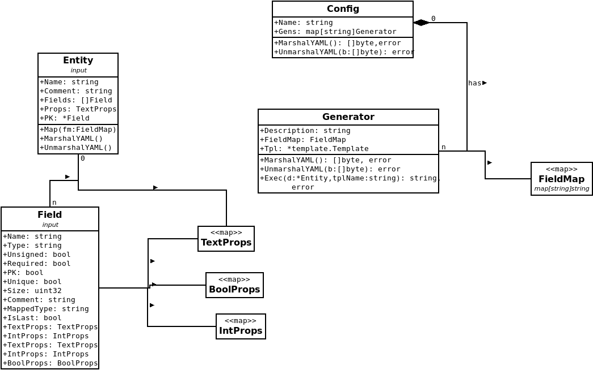

# Gogo

A code generator in go. Input files must be written in [YAML](https://en.wikipedia.org/wiki/YAML).

## Parameters

1. Configuration file
2. Entity file
3. Templates files

## Description
The Entity file is mapped into the *Entity* and *Field* classes.
The Configuration file is mapped into the *Config* and *Generator* classes
Once we have both, we call the *Exec* method of the generator.



## Configuration File

The configuration file is a **yaml** file with the settings for the generators.

Example:

```yaml
name: gogo example config
generators:
  mysql:
    description: MySQL Data Definition Language (DDL)
    map: {big_int: bigint, date: date, date_time: datetime, int: int, medium_text: mediumtext, small_int: smallint, string: varchar, uuid: binary(16)}
  go:
    description: GO Entity Struct
    map: {big_int: bigint, date: time.Time, date_time: datetime, int: int32, medium_text: string, small_int: smallint, string: string, uuid: string}
```

Gogo can generate code for many use cases. The code generation is made with the tpl files.

A generator consists of:

- A list of templates (*.tpl*)]
- A field map specified by **map**

During the code generation, all the field types specified in the entity file are replaced with the values specified in the *map* section of the generator.
For example, the type *int* for the generator **A** is mapped to *int* and  for the generator **B** to *int32*

## Entity File

Example:

```yaml
name: account
comment: Principal account table
props: {charset: utf8mb4, collate: utf8mb4_unicode_ci, package: accounting, goimports: time}
fields:
    - name: id
      type: int
      pk: true
      unsigned: true
      comment: pk
    - name: uid
      type: uuid
      required: true
      comment: unique id
    - name: name
      type: string
      size: 128
      required: true
      comment: account name
    - name: updated_at
      type: date_time
      required: true
      comment: last update datetime 
    - name: created_at
      type: date_time
      required: true
      comment: created datetime
```

A entity file specifies the **name**, **comments**, **fields** and additional **props**.
All the props are available for the templates during the generation.

## Build from source code

Download and install go if you haven't installed <https://go.dev/dl/>

`git clone git@github.com:lemenendez/gogo.git FOLDERNAME`

`cd FOLDERNAME`

`go build -o ./gogo cmd/gogo.go`

## How to start a new code-generation authoring project

Once the gogo binary is built you can add it to your PATH environment variable orr copy it to the project folder.

### Create a new folder for your code generation project

`mkdir myapp-code-generation`
`cd myapp-code-generation`

If gogo is not in your PATH then copy the gogo binary to **myapp-code-generation**

### Download examples (optional)

Examples are located here: <https://github.com/lemenendez/gogo/tree/main/pkg/examples>

Your project folder should look like this:

```
myapp-code-generation
  mysql
    01-create-table-apply.tpl
    01-create-table-rollback.tpl
    ..
  go
    struct.tpl
  .gogo       <- optional is gogo is in the PATH
  account.yml
  user.yml
  role.yml
  user-role.yml
  gogo-config.yml
```

## Usage

`./gogo -c gogo-config.yml account.yml mysql migration`

or
`./gogo account.yml mysql migration`

- the **c** flag specifies the configuration file, if not provided then uses current_dir\gogo-config.yml
- **examples/account.yml** param is the entity file
- **mysql** indicates the name of the generator
- **migration** indicates the name of the template
